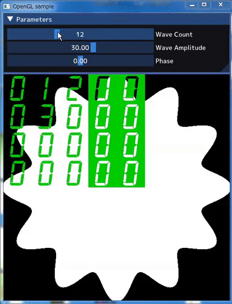
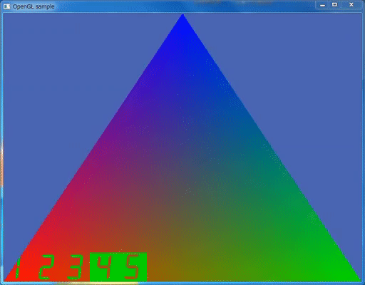

# glslDebugModule

glslDebugModuleは、OpenGLの2Dプログラム向けのGLSLデバッグ補助モジュールです。このモジュールを開発中のプログラムに追加することで、GLSLのデバッグの手助けとなることを目指しています。特に2D画像処理のようなアプリケーションに最適です。glslDebugModuleはWindowsとLinuxの両方で動作します。

（注: 3Dプログラムに対しても使用可能ですが、クリッピングによりデバッグ情報が制限される場合があります。）

## スクリーンショット


## セットアップ
セットアップは主に2つのステップで行います：GLSLのセットアップとC++のセットアップです。

また、開発中のGLSLをデバッグ対応にするための詳細なワークフローは、[adding_debug_module_workflow_jp.md](adding_debug_module_workflow_jp.md) で紹介します。

### GLSLのセットアップ：
あなたの GLSL にデバッグモジュールを追加する必要があります。デバッグモジュール挿入スクリプトを使用することで、簡単にGLSLにデバッグモジュールを追加することができます。具体的な方法は[insert_debug_module_manual_jp.md](scripts/insert_debug_module_manual_jp.md)を参照してください。

### C++のセットアップ：
C++側では、GLSLに数字のテクスチャアトラスを渡す必要があります。このプロセスは、GLSLのデバッグ情報を適切に表示するために必要なステップです。コード例は本マニュアルの最後に示します。


## glslDebugModule が提供する関数

- db_locate(): デバッグ情報を表示したい位置を指定します。
- db_print(): デバッグ情報として表示したい値を指定します。
- db_mix(): フラグメントカラーの定義 FragColor = your_fragment を FragColor = db_mix(your_fragment) に置き換えます。この関数により、デバッグ情報が適切に画面に表示されます。

## 使い方
まず、db_mix() を使って、フラグメントカラーの定義 FragColor = your_fragment を FragColor = db_mix(your_fragment) に置き換えます。

次に、デバッグ情報として表示したいデータ（float型）に対して db_print() を呼び出します。例えば、以下のようになります。

```cpp
db_print(123.45, 1);
```

## 仕様

- フラグメントシェーダーで使用します。
- 値は整数部が3桁、小数部が2桁です。表示できる値の範囲は -999.99 ～ +999.99 までです。
- 符号は文字色で識別できます。プラスの場合は緑色、マイナスの場合はピンク色です。

## 注意事項

- 一意に決まる値のみ確認できます。`gl_FragCoord.x` のように各フラグメントごとに値が異なるものは見ることができません。
- if文の中では使用できません。
- 同じシェーダーを複数呼ぶと、それぞれがデバッグプリントを行ってしまい表示が壊れます。これを回避するには、uniform 変数 `uDebugON`を使用します。 デバッグプリントを有効にしたいドローコールでのみ `uDebugON=1` とし、それ以外のドローコールでは、`uDebugON=0` とします。

## C++コード例

```cpp
// ユニフォーム変数を渡す
GLuint debug_digits_location = glGetUniformLocation(shader[GLSL_YOUR_SHADER].program, "debug_digits");
glUniform1i(debug_digits_location, 10);
glActiveTexture(GL_TEXTURE1);
glBindTexture(GL_TEXTURE_2D, m_texture[TEX_DEBUG_DIGITS]);
glBindSampler(1, m_sampler);

GLuint uDebugON_location = glGetUniformLocation(shader[GLSL_YOUR_SHADER].program, "uDebugON");
glUniform1i(uDebugON_location, 1);
```
m_texture[TEX_DEBUG_DIGITS]に数字のテクスチャアトラスがロードされているものとします。

## 追加のスクリーンショット

<br>
*このデモでは、マウスクリック位置をGLSL側で表示しています。(Linux Mint)*
<br><br><br>

<br>
*3Dプログラムではデバッグ情報がクリッピングされてしまいます。(Windows 7)*

## 謝辞

サンプルプログラムは、以下のソフトウェアを使用しています。

- [ImGui](https://github.com/ocornut/imgui)
- [stb](https://github.com/nothings/stb)
- [gl3w](https://github.com/skaslev/gl3w)

また、デジタルフォントの [mplus-1p-medium.ttf](https://fonts.google.com/specimen/M+PLUS+1p) も使用しています。